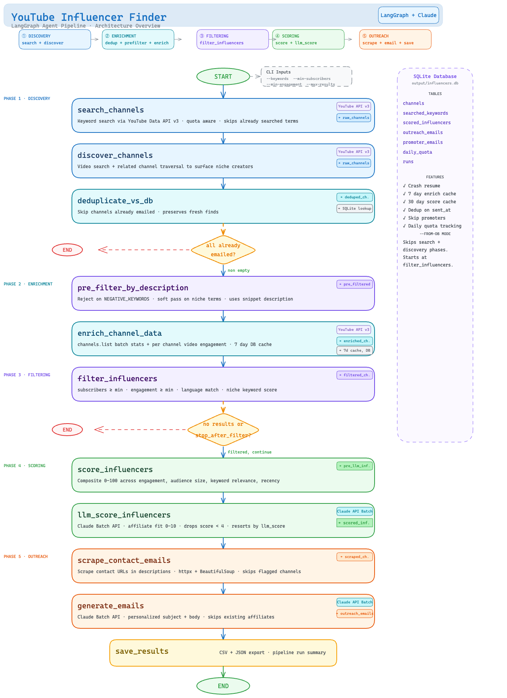

# YouTube Influencer Finder

A LangGraph-powered pipeline that finds, scores, and generates personalized outreach emails for YouTube creators. Fully configurable — point it at any niche, any product, any outreach goal.

---

## What it does

1. **Discovers** YouTube channels via keyword search, video-level search, and related-channel traversal
2. **Scores** each channel with a two-stage system: deterministic keyword matching + Claude LLM scoring
3. **Generates** personalized cold outreach emails using Claude via the Anthropic Batch API
4. **Sends** emails over SMTP with dry-run and rate-limit support

Everything — scoring rubric, email tone, keyword lists, sender identity, outreach purpose — is controlled through YAML config files. No Python changes required to retarget the pipeline.

---

## Architecture



**Discovery:**
- `search_channels` — keyword → channel search (`search.list(type="channel")`)
- `discover_channels` — two supplementary passes:
  - **Video search**: `search.list(type="video")` per keyword — surfaces niche creators not ranked in channel search
  - **Related traversal**: fetches channels related to top-scored DB channels via `relatedToVideoId`
- `deduplicate_vs_db` — drops channels already processed in previous runs
- `pre_filter_by_description` — fast regex/keyword pass on raw description before paying for enrichment API calls

**Scoring (two stages):**
- `score_influencers` — Stage 1: deterministic keyword matching, fast, free, no API calls
- `llm_score_influencers` — Stage 2: Claude LLM scoring via Anthropic Batch API, nuanced, async, cost-efficient

**Outreach:**
- `scrape_contact_emails` — scans channel descriptions and flags known promoters
- `generate_emails` — personalised email per channel via Claude Batch API
- `save_results` — writes CSV + JSON output and prints run summary

**Key files:**
- `src/state.py` — `GraphState` TypedDict (pipeline data contract)
- `src/graph.py` — LangGraph `StateGraph` assembly
- `src/db/database.py` — SQLite persistence layer
- `src/tools/youtube_client.py` — YouTube Data API v3 wrapper with quota rotation
- `src/nodes/` — one file per graph node
- `scripts/` — standalone scripts for each manual workflow step

---

## Setup

```bash
python -m venv .venv && source .venv/bin/activate
pip install -r requirements.txt
cp .env.example .env   # fill in your API keys
```

**Required API keys** (in `.env`):
- `YOUTUBE_API_KEY` — [Google Cloud Console](https://console.cloud.google.com/) → enable YouTube Data API v3
- `ANTHROPIC_API_KEY` — [console.anthropic.com](https://console.anthropic.com/)

---

## Configuration

All tunable behavior lives in three YAML files at the repo root. Edit them — no Python needed.

### `scorer_config.yaml`
Controls the LLM scoring step:
- **System prompt** — describe your product and target audience so Claude knows what a "good fit" channel looks like
- **Scoring rubric** — 0–10 scale with band descriptions
- **Batch settings** — poll interval, timeout, max tokens

### `email_config.yaml`
Controls email generation:
- **System prompt** — sender persona and writing rules
- **User prompt template** — per-channel email instructions
- **Sender identity** — name, title, company (used in sign-offs)
- **Outreach purpose** — one sentence describing why you are reaching out (injected into every email prompt)
- **Subject line strategies** — video_reference → audience_problem → curiosity → casual
- **Constraints** — subject max length, body word count, banned words, language detection

### `pipeline_config.yaml`
Controls the pipeline logic:
- **Keyword scoring** — high/medium/low value keywords (deterministic scoring), negative keywords, niche tag mapping
- **Filter** — niche keywords used in the hard filter before scoring
- **Scoring weights** — subscriber tier breakpoints, engagement log scale, tutorial signal list
- **LLM score floor** — minimum LLM score to keep a channel in the pipeline
- **Discovery** — seed channel threshold, related traversal depth
- **YouTube client** — retry settings, backoff config

---

## Workflows

### A. Full pipeline (search → score → email in one shot)

```bash
# Default run (reads keywords from keywords.txt)
python main.py

# Tune the channel filters
python main.py --min-subscribers 5000 --max-subscribers 500000 --min-engagement 1.5

# Use a second keyword file
python main.py --keywords-file2 keywords2.txt

# Pass keywords directly
python main.py --keywords "notion tutorial" "airtable automation" "zapier for beginners"

# Preview only — stop after filtering, no LLM scoring or emails
python main.py --stop-after-filter

# Control YouTube API quota budget (default 8000 units, daily limit is 10,000)
python main.py --quota-budget 5000
```

### B. Manual step-by-step workflow

Run each step independently so you can review results between stages.

```
1. Discover & score  →  2. Export CSV  →  3. Add emails  →  4. Import emails  →  5. Generate text  →  6. Send
```

**1. Discover and score channels**

```bash
python main.py --stop-after-filter
python scripts/llm_score_from_db.py    # LLM scoring via Claude Batch API
```

**2. Export to CSV for review**

```bash
python scripts/export_csv.py
# Opens output/channels_export.csv — all scored channels not yet emailed
```

**3. Add contact emails to the CSV**

Fill in the `contact_email` column for the channels you want to email:
- Use emails extracted automatically (see step below)
- Add emails manually from channel About pages

To permanently exclude a channel from future exports: set `no_email = 1` in that row.

**4. Import emails back to the DB**

```bash
python scripts/import_emails.py output/channels_export.csv
```

Only channels with a `contact_email` will be emailed. Channels marked `no_email = 1` are flagged in the DB.

**5. Generate email text**

```bash
python scripts/generate_emails.py
# Calls Claude via Anthropic Batch API — async, cost-efficient
# Skips channels already sent. Results saved to DB.
```

**6. Preview and send**

```bash
python send_emails.py --dry-run         # Preview only — no emails sent
python send_emails.py --limit 3         # Send to EMAIL_TEST_OVERRIDE address
python send_emails.py                   # Send all pending
```

---

## Utility commands

**Extract contact emails from channel descriptions**
```bash
python scripts/extract_emails_from_descriptions.py
# Scans channel descriptions in the DB for email addresses
```

**Find contact emails by scraping websites**
```bash
python -m scripts.find_contact_emails example.com anothersite.com
python -m scripts.find_contact_emails --file urls.txt
```
Checks nav/footer links, common paths (`/contact`, `/about`), and falls back to a headless browser (Playwright) for JS-rendered sites.

**Re-run DB mode (skip discovery, re-score/re-email existing channels)**
```bash
python main.py --from-db
python main.py --from-db --since-date 2025-01-01
```

**Force re-enrichment (bypass enrichment cache)**
```bash
python main.py --force-reenrich
```

**Mark a channel as contacted manually**
```bash
sqlite3 output/influencers.db \
  "UPDATE outreach_emails SET sent_at = datetime('now') WHERE channel_id = 'UCxxx';"
```

**View top scored channels**
```bash
sqlite3 output/influencers.db \
  "SELECT channel_title, composite_score, llm_score FROM scored_influencers
   JOIN channels USING (channel_id)
   ORDER BY llm_score DESC, composite_score DESC LIMIT 20;"
```

**Check what's pending**
```bash
sqlite3 output/influencers.db "
  SELECT c.channel_title, c.contact_email
  FROM scored_influencers si
  JOIN channels c USING (channel_id)
  WHERE c.contact_email IS NOT NULL AND length(c.contact_email) > 0
    AND si.channel_id NOT IN (SELECT channel_id FROM outreach_emails WHERE sent_at IS NOT NULL);"
```

---

## How the approval flow works

| Signal | Meaning |
|---|---|
| Channel in `scored_influencers` | Passed filter + scoring |
| `contact_email` set in `channels` | You reviewed it and want to email it |
| `outreach_emails.generated_at` set | Email text was generated |
| `outreach_emails.sent_at` set | Email was sent — will never be emailed again |

There is no separate "select" step. Adding a contact email is your approval signal.

---

## Requirements

- Python 3.11+
- YouTube Data API v3 key
- Anthropic API key
- SMTP credentials (only needed for `send_emails.py`)
